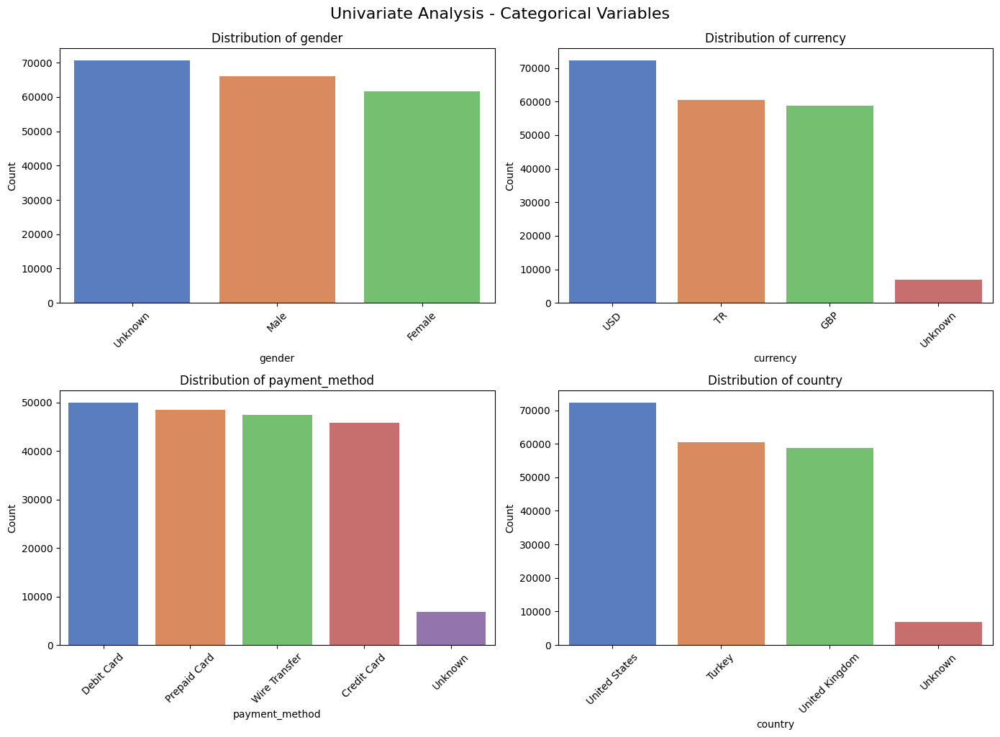

# Customer Risk Classification and Future Value Prediction

This project was developed in response to a technical assessment from WonderMatrix.  
The objective was to analyse customer betting behaviour and:

1. Categorise customers into "risky" and "non-risky" groups.
2. Predict the future value of each customer to the business.

The approach was modular, with clear separation of data cleaning, exploratory analysis, feature engineering, modeling, and evaluation. Each task was addressed using tailored methodology and supporting justifications for model choice.

---

## Task 1: Risk Classification

### Label Construction

Customers were classified as "risky" using a rule-based approach based on:
- Low win rate (`win_rate < 0.3`)
- High volatility in stakes (`std_stake > avg_stake`)
- Negative total revenue

These conditions reflect behavioural signals associated with inconsistent or aggressive betting patterns, which may indicate financial risk to the business or harm to the customer.

### Feature Engineering

From transaction-level data, aggregate features were generated at the customer level to capture volume, behaviour, and outcome dimensions:
- **Volume-based:** `total_bets`, `total_stake`
- **Behaviour-based:** `avg_stake`, `std_stake`, `win_rate`, `avg_odd`, `std_odd`
- **Outcome-based:** `total_revenue`

All features were numeric and required no encoding or transformation for tree-based models.

### Model Selection and Justification

A **Random Forest Classifier** was chosen for its ability to:
- Handle numerical data without preprocessing
- Model non-linear relationships between features
- Resist overfitting through ensemble learning and built-in regularisation
- Naturally handle variance and feature interaction

Initial model results showed perfect classification performance on the test set.  
To ensure this wasn’t due to overfitting, **GridSearchCV** with five-fold cross-validation was applied, tuning:
- `max_depth`
- `min_samples_leaf`
- `min_samples_split`
- `max_features`

Despite introducing these regularisation constraints, the confusion matrix remained unchanged.  
This suggested that the engineered features strongly and consistently predict the target variable, reinforcing the internal consistency of the risk label.  
However, it also highlights the need for future evaluation on live, unseen data to confirm generalisability.

---

## Task 2: Customer Future Value Prediction

### Target Definition

The future value of each customer was defined as their **total revenue**, reflecting their net profitability to the company based on historical betting behaviour.

### Modeling Approach

A **Random Forest Regressor** was used to predict future value, leveraging the same feature set developed during the classification task.  
This model was selected for its ability to:
- Handle non-linear patterns
- Manage skew and variability in monetary values
- Produce robust, generalisable predictions with low bias

### Evaluation Metrics

- Mean Absolute Error (MAE)
- Root Mean Squared Error (RMSE)
- Coefficient of Determination (R²)

---

## Exploratory Data Analysis

Several plots were generated to better understand the data and inform feature engineering:

| Plot Description | Visualisation |
|:-----------------|:--------------|
| Univariate Analysis of Categorical Features |  |
| Univariate Analysis of Numerical Features |  |
| Bivariate Analysis of Categorical Features |  |
| Bivariate Analysis of Numerical vs Categorical Features |  |
| Bivariate Analysis of Numerical vs Numerical Features |  |
| Multivariate Correlation Heatmap |  |

---

## Evaluation Strategy

Both classification and regression models were evaluated using separate stratified test sets.

### Classification Metrics:
- Accuracy
- Precision
- Recall
- F1 Score
- AUC
- Confusion Matrix

### Regression Metrics:
- MAE
- RMSE
- R² Score

All evaluation outputs were saved in a structured outputs directory for traceability.

---

## Tools & Libraries

- Python (pandas, numpy, scikit-learn, matplotlib, seaborn)
- Jupyter Notebook for prototyping
- VS Code for modular script development
- GridSearchCV for model tuning and validation

---

## Final Notes

This project demonstrates a structured, reproducible approach to customer segmentation and future value estimation using transactional iGaming data.  
The modeling pipeline was aligned with the business logic used to construct the risk label.  

While the Random Forest model achieved perfect classification on test data, **regularisation techniques** (via hyperparameter tuning using GridSearchCV) confirmed that this was due to the strength of the engineered features rather than model overfitting.  
Further evaluation on unseen or live data is recommended to confirm long-term generalisability, fairness, and robustness.

---
